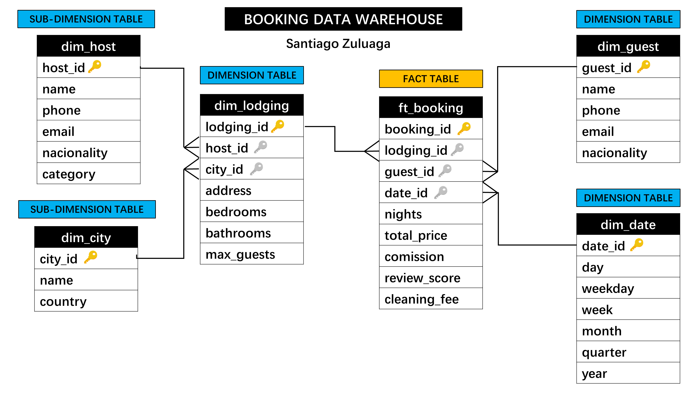

# Data Warehouse for a Booking company

* This is a **simplificated** and ilustrative example of how a company with a business model similar to **Booking** or **AirBnb** can model a Data Warehouse.

* A Snowflake schema is used.

* [Code for the tables creation in PostgreSQL](./table-creation.sql)

